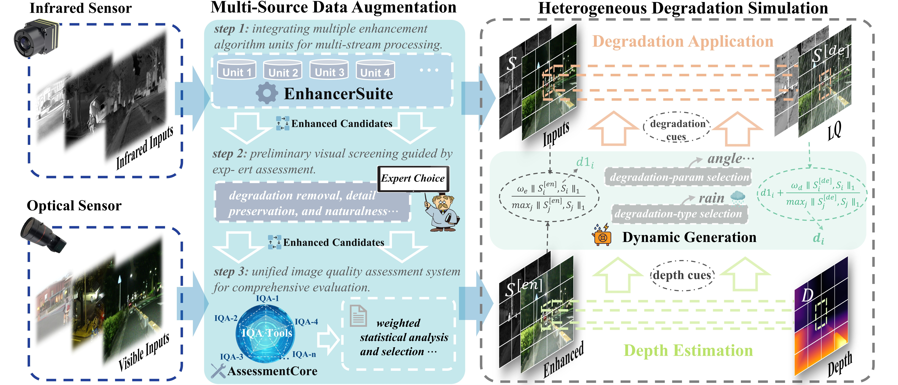

# 📦 Data Preparation

The training data consist of the paired **GDFusion** dataset and the natural
images used for **Generative Modulation**.

## 1. 🧩 GDFusion

### 🔗 Sources and splits

GDFusion combines aligned visible-infrared pairs from three public datasets.

| Dataset | Training pairs | Test pairs |
| :--- | ---: | ---: |
| [MSRS](https://github.com/Linfeng-Tang/MSRS) | 1,083 | 361 |
| [LLVIP](https://drive.google.com/file/d/1VTlT3Y7e1h-Zsne4zahjx5q0TK2ClMVv/view?usp=sharing) | 832 | 138 |
| [RoadScene](https://github.com/hanna-xu/RoadScene) | 169 | 52 |
| **Total** | **2,084** | **551** |

### 🧱 Construction pipeline



The source pairs are processed by multiple enhancement methods, followed by
expert screening and image-quality-based selection. Depth and degradation cues
then guide the dynamic selection of degradation types and parameters.

### 🎛️ Online degradation

The prepared data include raw visible images, enhanced visible references,
infrared images, and depth maps.

| Modality | Degradation types | Sampling diversity |
| :---: | --- | :---: |
| **Visible** | Noise · Blur · Rain · Snow · Haze | Random type · Random strength · Random parameters |
| **Infrared** | Noise · Low contrast · Stripe noise | Random type · Random strength · Random parameters |

### ⬇️ Download

Download the prepared package from
[**Google Drive**](https://drive.google.com/drive/folders/1p96_NS02-k4MfyWxAssHyTPRgawP3Fe3),
extract it, and place the `GDFusion` folder under `data/`.

### 🗂️ Directory layout

```text
data/GDFusion/
├── train/
│   ├── vis/
│   ├── vis_enhance/
│   ├── ir/
│   └── depth/
└── test/
    └── <MSRS|LLVIP|RoadScene>/
        ├── vis/
        ├── vis_enhance/
        ├── ir/
        ├── depth/
        ├── vis_lq/
        └── ir_lq/
```

Paired files in all folders must have the same filename.

## 2. ✨ Generative Modulation

### 🔗 Source datasets

Prepare the training images from the following datasets. Semantic label maps are
optional.

| Dataset | Data used |
| :--- | :--- |
| [COCO](https://cocodataset.org/#download) | Natural images and semantic labels |
| [ImageNet](https://www.image-net.org/download.php) | Natural images |
| [LLVIP](https://drive.google.com/file/d/1VTlT3Y7e1h-Zsne4zahjx5q0TK2ClMVv/view?usp=sharing) | Low-light visible-infrared images |

### 🧪 Included example

This repository includes **64 image-label pairs** as a format example.

```text
data/generation/train/
├── images/
│   ├── 000000000139.jpg
│   └── ...
└── labels/
    ├── 000000000139.png
    └── ...
```

### ✅ Format requirements

| Item | Requirement |
| :--- | :--- |
| **Images** | Place training images in the directories listed by `image_roots`. |
| **Labels** | Use optional single-channel PNGs with the same stem as the corresponding image. |
| **Pixel values** | Use the semantic IDs in `class_names`; value `255` is ignored. |
| **Configuration** | Set `image_roots`, `image_ratios`, and `label_root` in `configs/train/generative_modulation.yaml`. |
